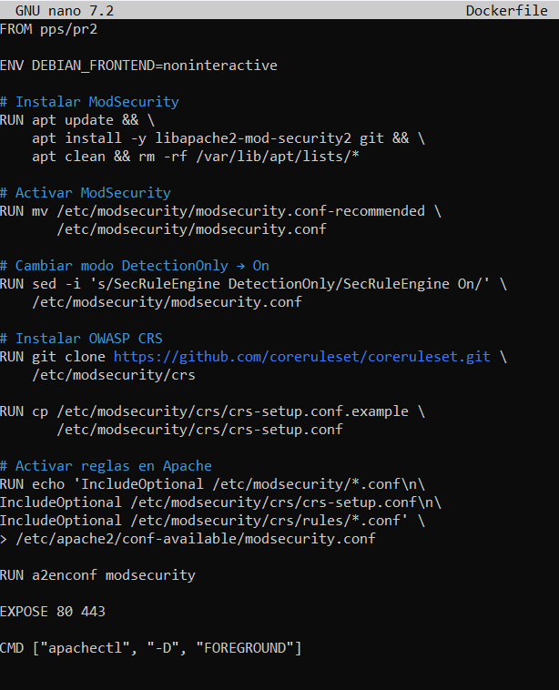
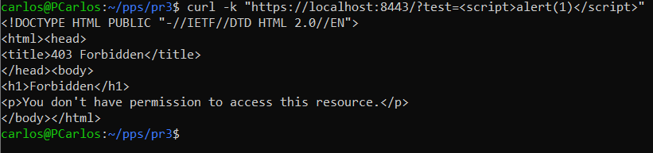

# Práctica 3 – Web Application Firewall (WAF)

## Objetivo
Implementar un mecanismo de protección frente a ataques web mediante el uso de un Web Application Firewall basado en ModSecurity.

## Implementación
Se ha integrado ModSecurity en el servidor Apache dentro de un contenedor Docker.  
Se ha configurado el motor de reglas y se ha activado el conjunto de reglas OWASP Core Rule Set para detectar y bloquear ataques comunes como inyecciones de código.

## Evidencias
- Dockerfile con la instalación y configuración de ModSecurity.

- Petición maliciosa realizada con curl que es bloqueada por el WAF.

## Conclusión
La implementación de ModSecurity permite detectar y mitigar ataques web de forma automática, reforzando significativamente la seguridad de la aplicación web.
