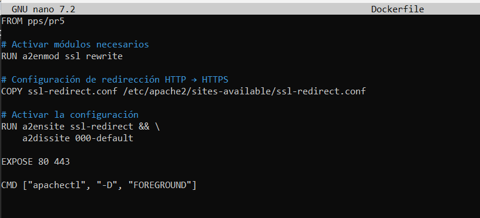
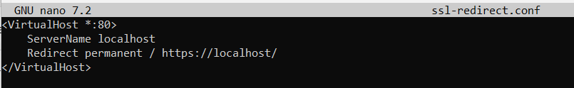
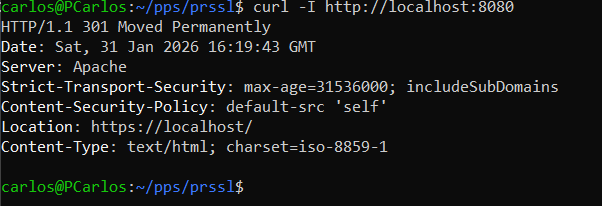

# Práctica SSL – Certificados digitales y redirección HTTPS

## Objetivo
Configurar un servidor web para utilizar conexiones seguras mediante HTTPS, empleando certificados digitales, y garantizar que todas las peticiones realizadas por HTTP sean redirigidas automáticamente a HTTPS.

## Implementación
Para esta práctica se ha reutilizado la configuración del servidor Apache desarrollada en prácticas anteriores, que ya incluía soporte HTTPS mediante un certificado autofirmado generado con OpenSSL.

Sobre esta base, se ha añadido una configuración específica para redirigir automáticamente todas las peticiones realizadas por el puerto 80 (HTTP) hacia el puerto 443 (HTTPS), asegurando que el acceso al servicio web se realice siempre de forma cifrada.

La redirección se ha implementado únicamente en Apache, ya que en la práctica correspondiente a NGINX esta funcionalidad ya se encontraba configurada de forma nativa mediante una regla de redirección HTTP a HTTPS, cumpliendo así el objetivo de la práctica sin necesidad de duplicar configuraciones.

La solución se ha implementado mediante un nuevo Dockerfile que hereda de la imagen base de Apache, manteniendo un diseño modular y reutilizable.

## Evidencias
- Dockerfile con la configuración de redirección HTTP a HTTPS en Apache.
  

- Archivo de redireccion para aplicar en el Dockerfile

- Prueba realizada con curl mostrando la redirección automática desde HTTP hacia HTTPS.

## Conclusión
Con esta práctica se ha conseguido asegurar las comunicaciones del servidor web mediante el uso de HTTPS, evitando accesos no cifrados. La redirección automática garantiza que cualquier intento de acceso por HTTP sea redirigido a una conexión segura, mejorando la confidencialidad e integridad de los datos transmitidos.  
Se destaca que los certificados utilizados son autofirmados, válidos para entornos de prueba y aprendizaje, siendo necesario el uso de certificados emitidos por una Autoridad de Certificación en entornos de producción.
